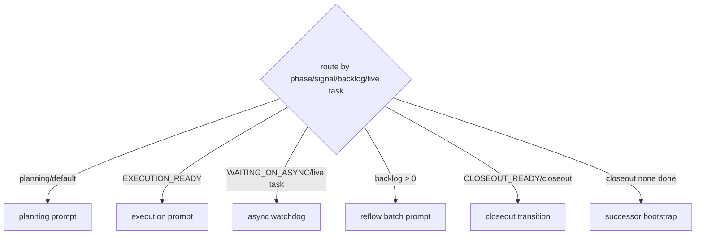

# LangGraph Adapter / LangGraph 化说明

`codex-taskboard` 的核心产品不是替代 LangGraph，而是把 Codex 科研 agent 的人类控制信号工程化。为了便于和 LangChain/LangGraph 生态沟通，本项目提供一个可选 LangGraph adapter，把既有状态机映射为标准 graph runtime。

## 定位

- LangGraph 是通用 stateful agent runtime。
- `codex-taskboard` 是面向 Codex 科研 agent 的 ResearchOps control plane。
- adapter 的作用是把 taskboard 的 prompt protocol 和 phase/signal 路由显式呈现为 LangGraph graph，而不是重写原有调度器。

## 状态映射

输入 state 字段：

- `phase`: `planning` / `execution` / `closeout`
- `signal`: `EXECUTION_READY` / `WAITING_ON_ASYNC` / `CLOSEOUT_READY` / `none`
- `live_task_status`: `none` / `submitted` / `awaiting`
- `automation_mode`: `managed` / `continuous`
- `backlog_count`: 待回流 receipt 数量
- `has_live_task`: 是否存在 live task
- `closeout_done`: closeout 是否已经输出 terminal `none`

输出字段：

- `next_node`: graph 路由节点
- `prompt_scene`: 对应 taskboard prompt scene
- `action`: 产品动作
- `reason`: 路由理由

## Graph



## 使用

安装可选依赖：

```bash
pip install -e ".[langgraph]"
```

Python 示例：

```python
from codex_taskboard.langgraph_adapter import run_taskboard_langgraph, snapshot_from_taskboard

state = snapshot_from_taskboard(
    phase="execution",
    signal="WAITING_ON_ASYNC",
    has_live_task=True,
)
result = run_taskboard_langgraph(state)
print(result["prompt_scene"])  # resume
print(result["action"])        # monitor_async_task
```

CLI smoke：

```bash
codex-taskboard langgraph --phase execution --signal WAITING_ON_ASYNC --has-live-task
codex-taskboard langgraph --mermaid
```

## 和原生 taskboard 的关系

当前 adapter 是低侵入映射层：

- 不改变 CLI/API/dispatcher/dashboard 的稳定行为。
- 不把 LangGraph 设为强制运行时依赖。
- 用于产品叙事、可视化、面试展示和未来接入 LangChain/LangGraph 应用。

这使得简历叙事可以更清晰：

> 基于 LangGraph 思路将科研 agent 生命周期显式化为 state graph，同时保留 codex-taskboard 对真实 Codex session、tmux/PID/API 任务、结果回流和 successor bootstrap 的本地控制能力。
